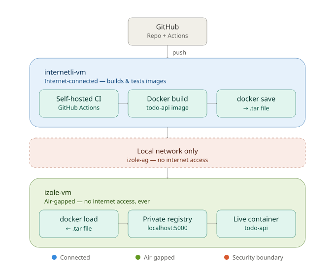

# Air-Gapped Deployment Simulator
 
A CI/CD pipeline that builds, tests, and ships a containerized application from an internet-connected machine into a fully isolated (air-gapped) one, with no internet access at any point on the isolated side.
 
Two VMs simulate two network zones connected only by a private local link:
 
- **`internetli-vm`** — internet access, source code, self-hosted CI runner, image builds
- **`izole-vm`** — no internet access, own private Docker registry, runs the production container
## Architecture
 

 
`izole-vm` never talks to GitHub, Docker Hub, or any external service. Everything it needs arrives as a file over a local network link that has no route to the internet.
 
## Stack
 
| Layer | Tool | Reason |
|---|---|---|
| Virtualization | VirtualBox | Free, fine-grained network adapter control |
| Application | Python + FastAPI | Minimal boilerplate, keeps focus on the pipeline |
| Containers | Docker + docker-compose | Guarantees environment parity between the two VMs |
| Version control | Git + GitHub | Source of truth, workflow automation |
| CI | GitHub Actions, self-hosted runner | Build stays on owned infrastructure |
| Registry | `registry:2` | Private, no internet dependency |
| Transfer | `docker save` / `scp` / `docker load` | Standard offline-transfer pattern |
| Automation | Bash scripts | Replaces every manual step with one command |
 
## Repository structure
 
```
.
├── main.py                      # FastAPI CRUD application
├── Dockerfile
├── docker-compose.yml
├── requirements.txt
├── .github/workflows/ci.yml     # Self-hosted CI: build + test on every push
├── push-to-isolated.sh          # Run on internetli-vm: build → save → transfer
└── deploy.sh                    # Run on izole-vm: load → tag → push → redeploy
```
 
## Pipeline
 
1. Code is pushed to `main`.
2. GitHub Actions triggers a workflow on a **self-hosted runner** on `internetli-vm` — not on GitHub's cloud. The image is built and smoke-tested inside owned infrastructure.
3. `./push-to-isolated.sh <version>` on `internetli-vm`: builds the image, saves it to a `.tar` (`docker save`), transfers it to `izole-vm` over the local network (`scp`). No internet involved.
4. `./deploy.sh <version>` on `izole-vm`: loads the image (`docker load`), tags and pushes it to the local private registry, stops the old container, starts the new version, verifies it's live.
Steps 3 and 4 are each a single command — no manual Docker commands, no manual file copying.
 
## Why a self-hosted runner instead of GitHub-hosted
 
GitHub's hosted runners build code on Microsoft's infrastructure, not the team's own. That breaks this project's core requirement: the build artifact has to originate from, and stay inside, infrastructure the team fully controls, so it can move into an isolated network without depending on an external cloud service at any point. A self-hosted runner on `internetli-vm` keeps the entire build process inside the boundary being simulated.
 
## Real-world context
 
Air-gapping — running systems with no connection to the public internet — is a standard practice in regulated and high-assurance industries (defense, finance, critical infrastructure), because it removes an entire category of remote-attack risk. Standard cloud-hosted CI runners and container registries simply aren't reachable from such networks, so teams run local equivalents inside the isolated boundary instead — the same problem this project's self-hosted runner and private registry solve at a small, learnable scale.
 
## Key design decisions
 
| Decision | Chosen | Rejected | Why |
|---|---|---|---|
| Isolation network | VirtualBox Internal Network | Host-only | Zero route to the host machine, not just the internet |
| IP addressing | Static IP | DHCP | Predictable, avoids an unnecessary attack surface |
| CI runner | Self-hosted | GitHub-hosted | Build artifact must never depend on external cloud infrastructure |
| Registry | Minimal `registry:2` | Harbor | Harbor's RBAC/UI/scanning are valuable in production but unnecessary to demonstrate the core mechanism |
| Registry | Self-hosted private registry | Docker Hub | Docker Hub requires internet access |
| Image transfer | `docker save` / `scp` / `docker load` | Shared folder, USB | Reused the existing SSH channel; in a true air-gap with no network link at all, this would become signed removable media |
 
## What this demonstrates
 
- Designing and validating a genuinely isolated network segment
- Building portable, environment-independent artifacts with Docker
- Running CI on owned infrastructure instead of a third-party cloud
- Moving a build artifact across a security boundary in a controlled, repeatable, scriptable way
- Automating a process that would otherwise depend on error-prone manual steps
---
 
<br>
<br>
