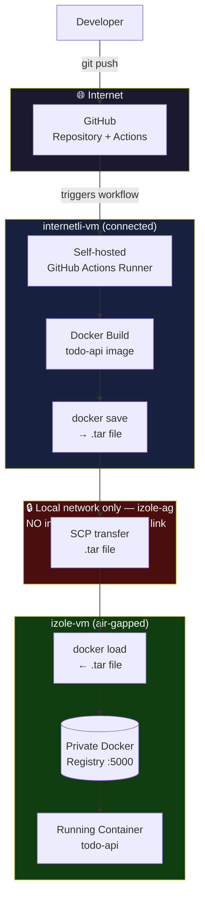

# Air-Gapped Deployment Simulator
 
A hands-on simulation of a CI/CD pipeline that builds, tests, and ships a containerized application from an internet-connected environment into a fully isolated (air-gapped) one — without ever exposing the isolated side to the internet.
 
This project was built to understand, from the ground up, a problem that real defense, finance, and critical-infrastructure teams face every day: **how do you deploy modern software to a network that is intentionally disconnected from the internet?**
 
---
 
## Overview
 
Two virtual machines simulate "two worlds":
 
- **`internetli-vm`** ("connected-vm") — has internet access, hosts the source code, the self-hosted CI runner, and builds the Docker images.
- **`izole-vm`** ("isolated-vm") — has **no internet access whatsoever**, connected to `internetli-vm` only through a private local network. It hosts its own private Docker registry and runs the production container.
The entire journey of a code change — from `git push` to a running container on the isolated machine — is automated, with the only "bridge" between the two worlds being a local, offline file transfer.
 
---
 
## Architecture
 

 
**Key point:** `izole-vm` never talks to GitHub, Docker Hub, or any external service. Everything it needs arrives as a file, carried across a local network link that has no route to the internet.
 
---
 
## Tech stack
 
| Layer | Tool | Why |
|---|---|---|
| Virtualization | VirtualBox | Free, fine-grained control over network adapters |
| Application | Python + FastAPI | Minimal boilerplate, lets the focus stay on the pipeline, not the app |
| Containerization | Docker + docker-compose | Guarantees environment parity between the two machines |
| Version control | Git + GitHub | Source of truth, workflow automation |
| CI | GitHub Actions (self-hosted runner) | Keeps the build process inside owned infrastructure — required by the isolation goal |
| Registry | Docker Registry (`registry:2`) | Private, no internet dependency, minimal footprint |
| Transfer | `docker save` / `docker load` / `scp` | Standard offline-transfer pattern for air-gapped systems |
| Automation | Bash scripts | `push-to-isolated.sh` and `deploy.sh` replace every manual step with a single command |
 
---
 
## Repository structure
 
```
.
├── main.py                      # FastAPI CRUD application
├── Dockerfile                   # Image build definition
├── docker-compose.yml           # Local run configuration
├── requirements.txt             # Python dependencies
├── .github/workflows/ci.yml     # Self-hosted CI: build + test on every push
├── push-to-isolated.sh          # Runs on internetli-vm: build → save → transfer
└── deploy.sh                    # Runs on izole-vm: load → tag → push → redeploy
```
 
---
 
## The pipeline, step by step
 
1. Code is pushed to `main` on GitHub.
2. GitHub Actions triggers a workflow — but it runs on a **self-hosted runner** living on `internetli-vm`, not on GitHub's cloud infrastructure. The image is built and smoke-tested entirely inside owned infrastructure.
3. When ready to ship, `./push-to-isolated.sh <version>` on `internetli-vm`:
   - builds the image,
   - saves it to a `.tar` file (`docker save`),
   - transfers it to `izole-vm` over the private local network (`scp`) — **no internet involved**.
4. On `izole-vm`, `./deploy.sh <version>`:
   - loads the image (`docker load`),
   - tags and pushes it to the local private registry,
   - stops the old container and starts the new version,
   - verifies the new version is live.
No manual Docker commands, no manual file copying — the entire release process after step 1 is two script invocations.
 
---
 
## Why self-hosted CI instead of GitHub-hosted runners?
 
This is the central architectural decision of the project. GitHub's own cloud runners are free, fast, and require no maintenance — but they build your code on Microsoft's infrastructure, not yours. For this project that would have broken the premise entirely: the whole point is that the build artifact must originate from, and stay inside, infrastructure the team fully controls, so it can be carried into an isolated network without ever depending on an external cloud service.
 
This mirrors a real constraint in regulated environments: when software must never leave an accredited boundary, build infrastructure has to live inside that boundary too.
 
---
 
## Real-world parallel: air-gapped deployment in defense and critical-infrastructure software
 
This isn't an artificial constraint invented for a portfolio project — it's a well-documented, everyday reality in defense and other high-assurance sectors.
 
Classified and mission-critical systems are commonly run on networks with no connection to the public internet, precisely because air-gapping removes an entire category of remote-attack risk. In practice, teams working under these constraints have to rebuild standard DevOps tooling — package mirrors, container registries, dependency feeds — entirely inside the isolated boundary, since the usual cloud-hosted registries and CI runners simply aren't reachable.
 
Movement of software between the connected and isolated sides is not informal — it typically goes through an accredited **Cross-Domain Solution (CDS)**, a dedicated hardware/software system that inspects and validates data before it's allowed to cross the boundary, or through controlled offline patterns: signed removable media with a documented chain of custody, one-way data diodes for inbound updates, or periodically refreshed offline package mirrors. Every transfer is logged and auditable, and the process is deliberately slower than a normal deployment — security is prioritized over convenience by design.
 
The U.S. Department of Defense has been formally pushing DevSecOps adoption since 2021 specifically to close the gap between fast-moving threats and traditionally slow acquisition cycles, but explicitly acknowledges that standard toolchains — cloud registries, hosted CI, live vulnerability feeds — have to be adapted to work fully disconnected. Programs pursuing accreditation ("Authority to Operate") have to demonstrate exactly this kind of controlled, auditable pipeline.
 
This project reproduces that shape at a small, learnable scale: a connected build environment, an isolated runtime environment, and a controlled, scriptable bridge between them — instead of ad-hoc, manual, undocumented file copying.
 
**Further reading:**
- Anchore — [Air Gapping for DevSecOps: Secure DoD Data](https://anchore.com/blog/dod-devsecops-air-gap-environment/)
- Zapata Technology — [DevSecOps in Classified Environments](https://www.zapatatechnology.com/devsecops-in-classified-environments-practical-approaches-for-defense-programs/)
- Corvus Intelligence — [Air-Gapped Deployments for Defense Software](https://corvusintell.com/blog/secure-cloud/air-gapped-deployment-defense/)
- Elastic — [Air-gapped ECK implementation: Strengthening DoD DevSecOps](https://www.elastic.co/blog/air-gapped-eck-implementation-dod-devsecops)
- OpenSSF — [Simplifying DevSecOps in Air-Gapped Environments with Zarf](https://openssf.org/blog/2025/11/18/tech-talk-recap-simplifying-devsecops-in-air-gapped-environments-with-zarf/)
---
 
## Key design decisions
 
| Decision | Chosen | Rejected alternative | Why |
|---|---|---|---|
| Isolation network | VirtualBox Internal Network | Host-only network | Internal Network has zero route to the host machine, not just the internet — a closer match to true air-gapping |
| IP addressing | Static IP | DHCP | Isolated networks commonly avoid DHCP entirely — it's an unnecessary attack surface and removes predictability |
| CI runner | Self-hosted | GitHub-hosted | Build must happen on owned infrastructure so the artifact never depends on an external cloud service |
| Registry | Minimal `registry:2` | Harbor | Harbor's RBAC/UI/scanning features are valuable in production but were unnecessary complexity for demonstrating the core mechanism |
| Registry | Self-hosted private registry | Docker Hub | Docker Hub requires internet access — directly incompatible with the isolated side |
| Image transfer | `docker save` / `scp` / `docker load` | Shared folder, USB | Reused the SSH channel already in place; in a true air-gap (no network link at all) this would become signed removable media instead |
 
---
 
## What this project demonstrates
 
- Designing and validating a genuinely isolated network segment (not just "no wifi," but no route out at all)
- Building portable, environment-independent artifacts with Docker
- Running CI on infrastructure you control, not a third-party cloud
- Moving a build artifact across a security boundary in a controlled, repeatable, scriptable way
- Automating a process that would otherwise depend on error-prone manual steps
---
 
<br>
<br>
# 🇹🇷 Türkçe
 
# Air-Gapped Deployment Simulator (İnternetsiz Ortama Dağıtım Simülatörü)
 
İnternete bağlı bir ortamda derlenip test edilen, konteynerleştirilmiş bir uygulamayı, internetten tamamen izole edilmiş (air-gapped) bir ortama — izole tarafı **hiçbir zaman** internete maruz bırakmadan — taşıyan uçtan uca bir CI/CD pipeline simülasyonu.
 
Bu proje, gerçek savunma sanayii, finans ve kritik altyapı ekiplerinin her gün karşılaştığı bir problemi sıfırdan anlamak için kuruldu: **modern bir yazılımı, bilinçli olarak internetten koparılmış bir ağa nasıl dağıtırsın?**
 
---
